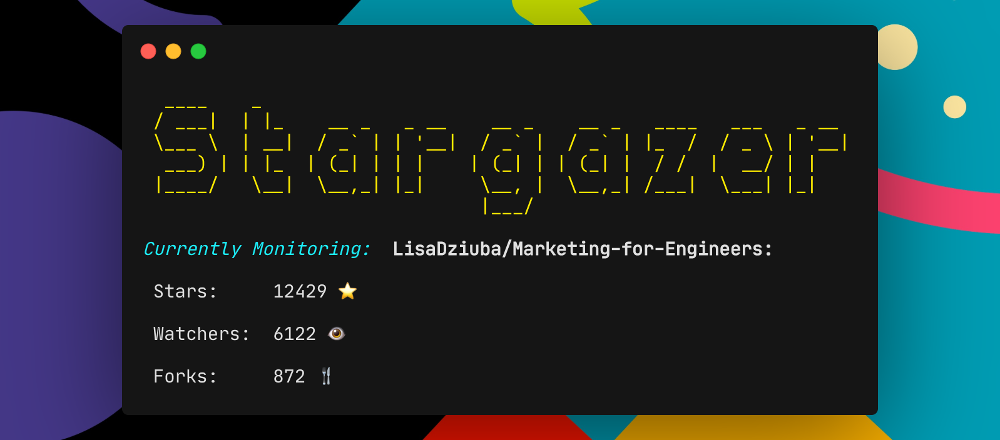

<h1 align="center">Welcome to Stargazer 👋</h1>
<p>
  
  <a href="#" target="_blank">
    
  </a>
  <a href="https://twitter.com/NicolasRacchi" target="_blank">
    
  </a>
</p>

<div align=center></img></div>

> A simple CLI tool to monitor Github stars, watchers and forks of any repository!

## Installation

```sh
git clone https://github.com/nicolas-racchi/Stargazer.git
cd Stargazer-master
npm install
```

## Usage

```sh
npm start
```

On the first run, you'll be asked to authenticate with a GitHub Personal Access Token.
In order to get one, follow the 3 simple steps explained in the CLI:

1. Visit [https://github.com/settings/tokens/new](https://github.com/settings/tokens/new)
2. Login and select "repo" as scope
3. Click on Generate Token

## Author

👤 **Nicolas Racchi**

- Website: www.nicolasracchi.com
- Twitter: [@NicolasRacchi](https://twitter.com/NicolasRacchi)
- Github: [@nicolas-racchi](https://github.com/nicolas-racchi)

## Show your support

Give a ⭐️ if this project helped you!

---

_This README was generated with ❤️ by [readme-md-generator](https://github.com/kefranabg/readme-md-generator)_
